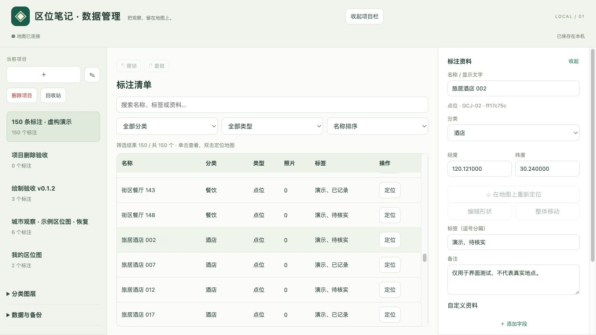

# 区位笔记 · 高德标注 v0.1.3

我做了一款叫「区位笔记」的浏览器插件，可以直接在高德地图上标记位置、绘制线段与区域，并为标注添加分类、照片和文字资料。
它来自一个实际工作中的小麻烦。
做地产、旅游或城市规划的区位图时，我经常需要先截图，再到 PPT 里画点、画线、圈范围。这样的方式能完成一张图，但当标注越来越多，修改、查找和整理资料就变得困难。下一次做类似的工作，又要重新开始。
我希望这些标注能够留下来，成为可以继续编辑、管理和复用的数据。在VibeCoding的热潮下，于是有了「区位笔记」。
目前，你可以用它：
- 在地图上表达想法：添加点位、线段、区域、半径圈和文字，调整节点或整体移动。
- 为位置整理资料：按分类管理标注，附上照片、标签、备注和自定义字段。
- 集中管理大量标注：在独立窗口中搜索、筛选和查看数据，与地图双向联动。
- 保存和复用成果：通过 CSV 双向导入导出点位，通过完整备份保留图形和照片。
它面向个人使用，无需注册账号，项目和照片保存在自己的浏览器中。目前支持桌面 Chrome / Edge 上的高德地图网页。

**版本状态：可加载的 Alpha 试用版。** 数据模型、模拟地图适配和本地界面已测试；尚未在安装此插件的真实 Chrome / Edge + 高德网页组合下完成端到端验收。高德官网没有向第三方插件提供稳定的地图实例接口，本版采用运行时适配，官网更新后可能需要调整。没有连接成功时会禁用绘图，不会把屏幕位置冒充地理坐标保存。

## v0.1.3 更新：独立数据管理

地图工作台点击 **“打开数据管理”**，或点击浏览器插件图标中的同名按钮，即可打开管理窗口。重复打开会复用已有窗口。地图关闭时仍可管理本地资料。

- **地图轻量面板**：保留项目切换、绘制工具、分类显隐和选中标注的编辑；移除长清单，底图设置和备份可折叠。
- **独立三栏布局**：项目列表、标注数据表、资料详情各自滚动；项目栏可折叠，详情可关闭。窗口较窄时详情以右侧抽屉展示。
- **表格清单**：名称、分类、类型、照片数、标签与定位按钮；支持全文搜索、分类 / 类型筛选、名称 / 分类 / 修改时间排序。表格包含隐藏图层中的数据；图层显隐只影响地图。
- **选择联动**：表格单击名称查看资料并高亮地图对象；双击名称或点击“定位”才移动地图。地图点击标注会同步管理窗口，必要时清除表格筛选以显示所选行。不会强制把另一窗口切到前台。
- **项目删除与回收站**：删除前展示标注 / 照片数量，可先导出备份。项目先进入本地回收站，照片和资料保留；可恢复，永久删除需再次确认。删除最后一个项目后显示新建 / 恢复入口。
- **跨窗口同步**：保存后通知其他窗口读取最新数据；正在编辑或绘制时提示有外部更新。版本冲突会阻止旧数据覆盖，请先导出本窗口备份，再点击“载入最新数据”。外部更新载入后清空该窗口撤销记录。
- **原有数据兼容**：继续使用原插件本地数据库，无需转换项目，未新增浏览器权限。

当前按一个高德工作窗口使用进行验收；多个地图页同时打开时，管理窗口保持连接一个在线页面，尚未提供手动选择地图页的界面。回收站占用本地存储，不属于自动备份；完整备份只包含当前项目，不包含其他项目及回收站。表格的万级数据性能尚未专项测试。

## v0.1.2 更新

- **线段 / 区域引导**：点击落点，鼠标移动时显示虚线预览；区域具有半透明预览，点击起点闭合，也可双击或按 Enter 完成。这一版采用逐点的多边形套索，暂不提供按住鼠标自由描边。
- **半径圈**：先点击圆心，再移动鼠标预览半径，第二次点击完成；也可输入 `500 米`、`1 公里` 后完成。圈表示直线距离范围。
- **绘制工具条**：绘制时工作台自动收起，底部显示完成、退回和取消；鼠标旁显示操作提示。Enter 完成、Esc 取消、Backspace 退回一点，按住空格可拖动地图。
- **形状编辑**：选择已有标注，点击“编辑形状”。白色节点可拖动，金色中点可插入节点；选中节点后点击“删除节点”，线段至少保留 2 点、区域至少保留 3 点。半径圈可拖动圆心和金色半径节点。
- **整体移动与撤销**：点击“整体移动”后拖动地图绘制区；“完成编辑”才保存，“取消”保留原图形；完成后可一次撤销整次编辑。
- **分类删除**：每类右侧“⋯”可修改名称 / 颜色、删除分类。空分类直接删除；有标注时默认迁移至另一分类，也可二次确认后连同标注及照片删除。删除统计包含被筛选隐藏的标注，操作可撤销，最后一个分类需要保留。

升级时请按下方说明覆盖原加载目录。本版不新增权限，原有项目格式保持兼容。

## v0.1.1 更新与升级

- 工作台顶部新增拖动条：按住“⠿ 区位笔记”移动，面板不会超出窗口。位置和展开状态会记住；窗口缩小时自动移回可见区域。
- 顶部“−”收起为可移动小条，“＋”展开，“↺”重置位置。手柄获得焦点时也支持方向键移动，Shift 加速。
- 默认面板向左移，避开原先右上角固定工具栏；可按当前高德页面布局自行摆放。
- 新增“隐藏兴趣点标注（即时）”：使用 SDK 的 `getFeatures` / `setFeatures`，只切换 point 要素，保留道路、建筑物等。取消时恢复原有兴趣点显示状态，不强制打开原来已关闭的要素。
- 新增“隐藏底图文字（刷新后）”：勾选或取消，再点“保存并刷新应用”；等项目保存完成后刷新，通过地图构造选项 `showLabel: false` 隐藏文字。取消后恢复高德自身默认设置。未完成绘图、照片处理中或保存失败时不会刷新。
- 底图标签设置仅在当前标签页会话内保留，不修改项目数据；工作台位置保存在扩展的 `chrome.storage.local`，因此此版新增 `storage` 权限。
- 插件自己的标注继续显示。高德搜索结果、路线、第三方覆盖层、卫星图里烘焙的文字不受此开关控制；官网若覆盖 SDK 设置，实际效果仍需页面验收。

**已有数据的升级方式：**先在旧版导出完整备份。解压新版，将新版 `extension/` 中的文件覆盖到之前加载插件的同一个 `extension/` 文件夹，保持路径不变；在浏览器扩展管理页点击原插件的“重新加载”，如浏览器要求确认新增权限则按提示处理，然后刷新高德。不要先卸载旧插件；卸载可能清除本地项目。若必须更换加载目录，应使用完整备份恢复数据。

参考：[高德 Map 接口](https://lbs.amap.com/api/maps-javascript-api/reference/amap-map/map)、[官方隐藏文字示例](https://lbs.amap.com/demo/JavaScript-api/example/personalized-map/map-showlabel)。

## 安装（Chrome 或 Edge）

1. 解压 `amap-notes-v0.1.3.zip`，保留解压后的文件夹，不要安装后移动或删除它。
2. Chrome 在地址栏输入 `chrome://extensions`；Edge 输入 `edge://extensions`。
3. 打开“开发者模式”，点击“加载已解压的扩展程序”。
4. 选择本项目中的 **extension 文件夹**，这一层应能直接看到 `manifest.json`。
5. 打开 `https://www.amap.com/`。如果页面已打开，**必须刷新一次**，让插件在地图初始化前接入。
6. 右侧出现“区位笔记”面板，显示“高德已连接”后可以标注。在浏览器工具栏固定插件图标，便于打开面板及导出 PNG。

仅支持桌面 Chrome / Edge（Chromium 111 或更高版本）；Safari、手机浏览器和高德 App 不在本版范围内。无需运行 npm 或 Python 即可加载插件。

## 第一次使用

- 使用高德原有搜索框找到所需区域；插件不会复制高德搜索结果库。
- 点击项目旁的“＋”新建项目，可以选择综合、地产、旅游、城市规划初始分类。
- 点击分类前的圆点，决定下一条标注所属分类；勾选框控制该分类是否显示。
- 点击“点位”，再点击地图。右侧填写名称、分类、标签、备注和自定义资料。资料输入后离开输入框保存。
- 线段和区域：逐点点击地图，移动鼠标查看预览；双击或 Enter 完成，区域也可点击起点闭合；Backspace 退回最后一点，Esc 取消。
- 半径圈：点击圆心，移动鼠标预览并再次点击完成；也可在工具条输入半径。它表示直线距离圈，不代表步行或驾车可达范围。
- 文字：点击地理锚点，修改“名称 / 显示文字”。
- 点位、半径圈、文字可用“在地图上重新定位”调整位置，或修改经纬度。
- 在独立管理窗口单击清单名称查看资料；双击名称或点击“定位”移动地图。地图上也可点击对象选择。
- 点、线、区域都可添加照片和自定义资料。照片只在本机压缩处理，最长边 1600 像素，保存在项目里的是压缩副本。
- 删除可通过“撤销”恢复，撤销/重做保留当前打开期间最近 30 步；关闭或切换项目后撤销记录不保留。

点击插件工具栏图标里的“导出当前视图 PNG”可截取当前可见地图页面。插件面板自动隐藏，标题和图例保留；高德原有界面及署名仍会出现在图片里。本功能已实现，待真实扩展环境验收。

## 本地保存与备份

项目和照片保存在**扩展页面自身的 IndexedDB**，不是高德账号、不是高德网页的 localStorage，也不会自动同步到云端。扩展页面禁止网络请求，没有埋点或外部字体。

- **完整备份**：导出 `.amapnotes` 文件，包含全部标注、坐标、分类、字段及照片。它是带格式标识的 JSON 项目包，文件本身未加密。
- **恢复备份**：先预览，再恢复为一个新项目。原项目保留；标注编号保留，新项目编号重新生成。
- **点位 CSV**：导出当前搜索和分类筛选下的点位。线、区域、半径圈、文字及照片本体不进入 CSV；这些内容请用完整备份保存。
- 卸载插件、清理扩展数据或更换浏览器配置可能丢失本地数据，请定期备份。
- 多个标签页修改同一项目时使用版本检查；发生冲突会停止保存并提示。先备份当前页面，再刷新并重新打开项目，避免静默覆盖。
- 最好等右上角“已保存在本机”出现后再关闭页面。

每项目最多 10,000 个对象、100 个分类；每图形最多 2,000 个顶点；每对象最多 20 张照片。单张原始照片最大 20 MB，格式 JPEG / PNG / WebP；项目数据上限 90 MB，恢复文件上限 100 MB。以上为保护性上限，尚未完成上限压力测试；建议第一轮使用几十到几百个对象。

## CSV 双向编辑

附带的 `examples/示例点位.csv` 可作为模板。字段为：

| 列名 | 含义 |
| --- | --- |
| id | 稳定编号；保留编号可更新原有点位，空白则新增 |
| name | 名称，必填 |
| longitude / latitude | 经度 / 纬度，必填 |
| crs | 坐标系，必须填写 GCJ-02 |
| category | 分类名称，不存在则创建 |
| tags | JSON 数组，例如 `["酒店","待核实"]` |
| notes | 备注，可包含换行 |
| fields | JSON 对象，例如 `{"房间数":80,"定位":"度假"}` |

导入支持手动列映射。先检查预览，再确认写入；有错误时整批不写入。文件内重复编号会报错，同名不同编号不会自动合并。更新时，空白可选字段保留原值；`[]` 清空标签，`{}` 清空自定义资料。要清空备注请在界面修改。照片不受 CSV 更新影响。

使用 UTF-8 CSV（本插件导出包含 BOM，可用 Excel 打开）。直接导入 `.xlsx`、只有地址的自动定位、WGS-84 / BD-09 自动转换尚未提供。以公式字符开头的文本导出时会加单引号防止表格执行公式，重新导入会还原。

## 示例项目

`examples/示例区位图.amapnotes` 包含点、线、区域、半径圈和文字。在“恢复备份”中打开，在管理窗口点击条目的“定位”按钮。所有内容均为虚构示例，不代表真实酒店、景点或规划范围。

## 本版暂未提供

- 自动把高德 POI、评论、图片或收藏抓取到项目。
- 按住鼠标自由描边套索、可自由摆放的标签引线、箭头、矩形专用工具。
- 字段类型配置（界面新增/修改字段按文本保存，导入可保留数字和布尔值）。
- 批量编辑、独立图层锁定、复杂地图制图排版。
- 地图视角随项目保存、卫星图专门适配、跨地图切换、地址地理编码。
- 离线底图、云端同步、协作分享、正式插件商店发布。

## 地图未连接时

先刷新高德页面，等待地图加载，确认网址为 `amap.com` 或 `www.amap.com`。若始终未连接，保留完整备份并记录网页地址、浏览器版本、扩展错误信息。不要在不连接时反复标注。插件依赖高德网页当前的 AMap SDK；代码提供新页面构造器接入和旧版 `themap` 兼容，但不是高德官方承诺的扩展接口。

## 源码与验证

无需打包步骤，`extension/` 就是加载目录。源代码无第三方依赖。

- `bridge.js`：页面主环境中的地图适配，只交换绘图所需位置和显示数据。
- `content.js`：隔离环境中的地图覆盖层与插件 iframe。
- `editor.js`：绘制预览、快捷键与临时形状编辑，确认后再交给工作台保存。
- `panel.*`：地图轻量面板和独立管理窗口共用的资料编辑界面。
- `store.js`：扩展自身的本地数据库、回收站及事务内版本检查。
- `sync.js`：扩展窗口消息通道；开发演示使用同源 BroadcastChannel。
- `core.js`：数据校验、CSV、备份及几何算法。
- `background.js` / `popup.*`：按用户点击截取当前高德页面。

开发测试：Node.js 18+ 下运行 `npm test`。本地交互演示运行 `npm run serve` 后打开 `http://127.0.0.1:8765/dev/`。演示页面使用模拟地图，只验证交互和适配协议，不等同于真实高德测试。演示数据也与真实插件数据相互独立。

详见 `TESTING.md`。

开发验收页：`dev/store-tests.html` 在真实 IndexedDB 中验证回收站与并发保存；`dev/large-project.html` 可生成独立的 150 条虚构标注项目。两者只用于本地开发，非高德真实地图验收。扩展 iframe 与管理页共享本地存储的行为参见 [Chrome 扩展存储文档](https://developer.chrome.com/docs/extensions/develop/concepts/storage-and-cookies)。
